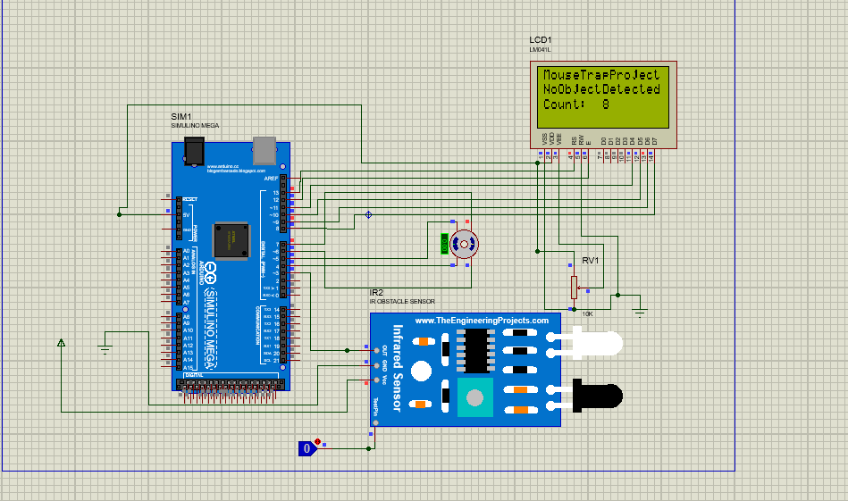

# Mouse-Trap-with-Arduino-and-Proteus
The setup is a revolving door (imagine propellers) with a stepper motor connected. It will use an Infrared sensor to sense any object that steps on it. The trap door rotates 90 degrees, releasing the object on top to the space below. The system resets itself and will be triggered again after 10 - 20 seconds. The motor essentially rotates 90 degree every time its triggered. The system utilizes an LCD to show the number of times it has been triggered.

Added a L298 Stepper Motor Driver for it to be possible to drive a big stepper motor (NEMA 23).

